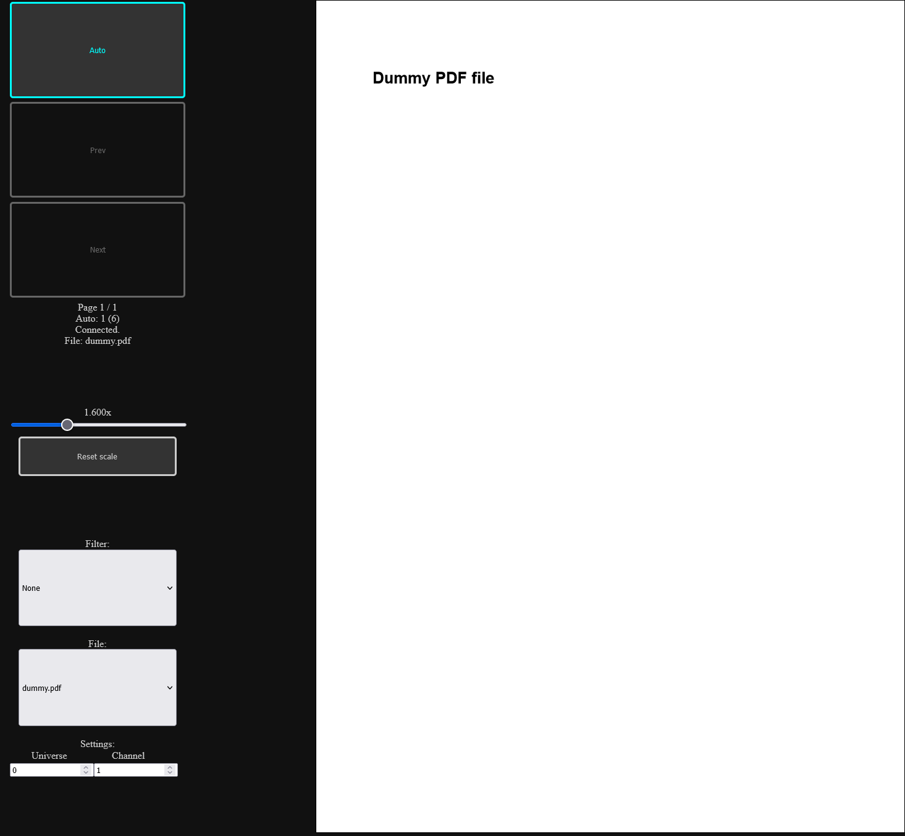

# SVANTh

## Script Viewer (Art-Net) for THeatre

Display PDFs in web browser, control scrolling using Art-Net channel levels.



First two channels picks page (as value, or as percent). Value `255` on second channel blanks output.

If second channel is `0`, first one is used as percent. If it is between `1` and `254`, then page number is calculated as `ch1 + 1 + 256 * (ch2 - 1)`.

Third channel picks file, if multiple are selected (WIP).

If there is only one PDF file in directory, it will be automatically selected.

## Status

Work In Progress. Proof-of-concept.

## TODO

- [ ] Multiple files support.

## Internals

## Example config file (`svanth.toml`)

```
Universe = 0
ChannelFrom = 1
Filter = "None"
File = "dummy.pdf"
```
